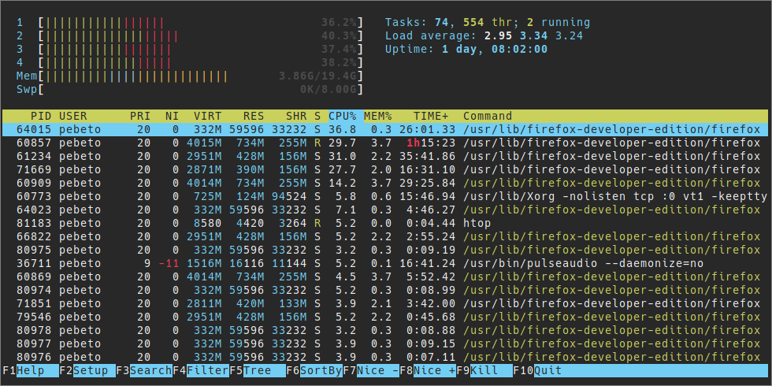

# tender-xresources

**xresources** color specification inspired by the [tender.vim](https://github.com/jacoborus/tender.vim) color scheme, made by [jacoborus](https://github.com/jacoborus).

### Installation
Replace (or paste) the current .Xresources file content into yours.
